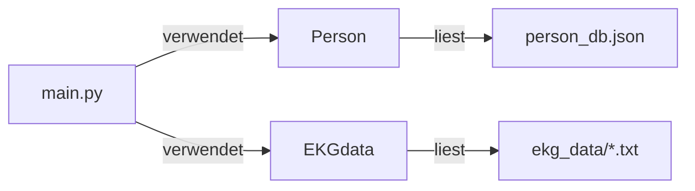
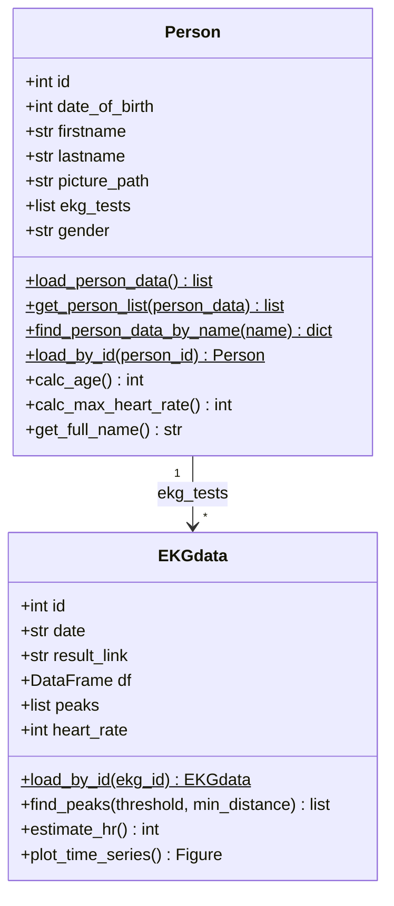
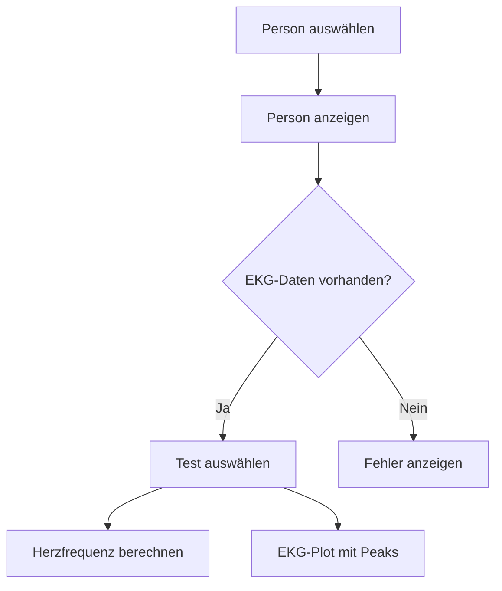

# EKG-Analyse Dashboard

Eine Streamlit-Web-App zur Analyse von EKG-Daten verschiedener Probanden. Peaks (R-Zacken) werden automatisch erkannt und die Herzfrequenz berechnet.

## Architektur



## Klassendiagramm



## Workflow



## Installation

```bash
pdm install
```

## Starten

```bash
pdm run streamlit run src/main.py
```

Die App ist dann unter [http://localhost:8501](http://localhost:8501) erreichbar.

## Projektstruktur

```
├── src/
│   ├── main.py          # Streamlit-App (UI + Workflow)
│   ├── person.py        # Person-Klasse
│   └── ekgdata.py       # EKGdata-Klasse (Peak-Detection, HR)
├── Data/
│   ├── person_db.json   # Personen-Datenbank
│   ├── ekg_data/        # EKG-Rohdaten (1000 Hz, mV + ms)
│   └── pictures/        # Profilbilder
└── pyproject.toml
```

## Technologien

| Komponente | Technologie |
|-----------|-------------|
| UI | Streamlit |
| Datenverarbeitung | Pandas, NumPy |
| Visualisierung | Plotly |
| Paketmanager | PDM |

Autoren:
Franziska Bernecker
Laurenz Keller